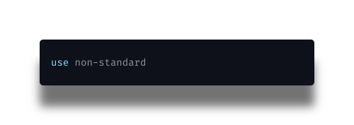
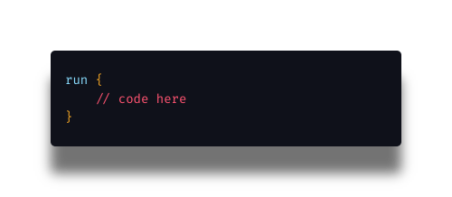
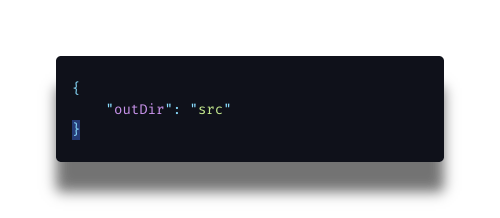
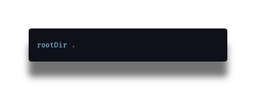
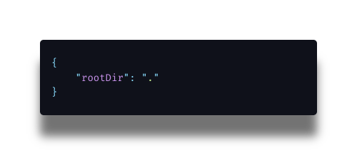
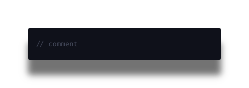

# Vide

---

## config

A very important part of Vide is to make sure that you or your team using Vide doesn't have to spend years in the config. So Vide uses a very easy to read syntax for the config (it is almost a mix between Yaml and Json). Incase you want to stick with normal Json you can.

### Non-standard Library

The non-standard library is a custom syntax used for writing videfile's. It is similar to Json but without the colons and commas.

The syntax pattern is as follows:

```
keyword value
or
keyword {
    value
}
```

To import the non-standard library use:



```
use non-standard
```

This line will tell the compiler that it should use the the non standard compiler and not parse Json.

### Config Hooks



```
run {
    // code here
}
```

Config hooks allow you to add custom events before or after the code is compiled. Events are written in Javascript.

### Basic things

#### Settings Output Directory



```
{
    "outDir":"src"
}
```

**Json version**


```
outDir src

```

**Non-Standard Version**

This specifies the out directory for the compiled code.

#### settings root directory



```
outDir .
```

**Non-Standard Version**



**Json Version**

This options states the root directory or where your source code (.vide files) is.

#### comments



```
// comment
```

Comment lines can written as such.

### Basic Config


```
outDir src
rootDir .
```

# Vide langauge

Vide is a framework that shorthands HTML and CSS in a way By allow you to to type all of them in one file with some extra added perks.

### Basic concepts of Vide

_All tags are case sensitive_

Vide uses HTML like syntax for all operations in the langauge.

Every vide script starts with the following boiler plate code.

```
<Vide>

</Vide>
```

The Vide tag is similar to the html tag in HTML but instead for Vide.
